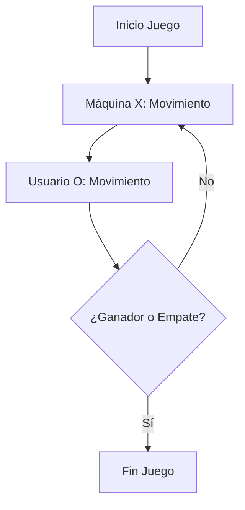

# 🎮 Tic-Tac-Toe (Tres en Raya) en Python

[](https://www.python.org/)
[](https://www.kaggle.com/code/rcurioso/tic-tac-toe-3-en-raya)
[]()
[](https://www.kaggle.com/code/rcurioso/tic-tac-toe-3-en-raya)

Un clásico juego de **Tres en Raya (Tic-Tac-Toe)** jugable directamente desde la terminal. Juega contra la máquina, la cual elige sus movimientos de forma aleatoria. ¡Intenta ganarle o terminar en empate!

---

## 📋 Tabla de Contenidos

- [📖 Descripción](#-descripción)
- [📜 Reglas del Juego](#-reglas-del-juego)
- [✨ Características Principales](#-características-principales)
- [🏗️ Estructura del Código](#-estructura-del-código)
- [📊 Diagrama de Flujo](#-diagrama-de-flujo)
- [🛠️ Instalación y Ejecución](#-instalación-y-ejecución)
- [🖼️ Ejemplo de Partida](#-ejemplo-de-partida)
- [🚀 Posibles Mejoras Futuras](#-posibles-mejoras-futuras)
- [👤 Autor](#-autor)
- [📚 Reconocimientos](#-reconocimientos)

---

## 📖 Descripción

Este proyecto es una implementación de consola del popular juego **"Gato"**, **"Tres en Raya"** o **"Tic-Tac-Toe"**. Está diseñado para practicar:

- Lógica de programación.
- Manejo de matrices (listas de listas en Python).
- Validación de entradas de usuario.
- Generación de números aleatorios.

---

## 📜 Reglas del Juego

- **Jugadores:**
  - La **máquina** juega con las **`X`**.
  - El **usuario** juega con las **`O`**.
- **Primer Movimiento:** La máquina siempre realiza el primer movimiento, colocando una `X` en el centro del tablero.
- **Tablero:**
  - Cuadrícula de **3x3** numerada del **1 al 9** (de izquierda a derecha, de arriba a abajo).
- **Movimientos:**
  - El usuario ingresa el número del cuadro donde desea colocar su `O`.
- **Fin del Juego:**
  - Un jugador alinea **3 símbolos** (horizontal, vertical o diagonal).
  - Se llenan los **9 cuadros** sin un ganador (**Empate**).

---

## ✨ Características Principales

✅ **Interfaz de Consola (CLI):**

- Tablero renderizado con **arte ASCII dinámico** que se actualiza tras cada turno.

✅ **Validación de Entradas:**

- Previene errores si el usuario ingresa:
  - Letras o caracteres no numéricos.
  - Números fuera de rango (1-9).
  - Posiciones ya ocupadas.

✅ **Lógica de Juego Completa:**

- Detección precisa de condiciones de **victoria**, **derrota** y **empate**.

✅ **Generación Aleatoria:**

- La máquina selecciona sus movimientos disponibles usando el módulo nativo `random`.

---

## 🏗️ Estructura del Código

El proyecto está **modularizado** en funciones clave para mantener el código **limpio, legible y desacoplado**:


| Función                           | Descripción                                                                                                    |
| --------------------------------- | -------------------------------------------------------------------------------------------------------------- |
| `display_board(board)`            | Dibuja el tablero en la consola con el estado actual usando caracteres ASCII.                                  |
| `enter_move(board)`               | Solicita el movimiento al usuario, valida la entrada y actualiza el tablero.                                   |
| `make_list_of_free_fields(board)` | Escanea el tablero y devuelve una lista de tuplas con las coordenadas `(fila, columna)` de los cuadros libres. |
| `victory_for(board, sgn)`         | Comprueba si el símbolo (`X` u `O`) ha logrado hacer tres en raya (filas, columnas o diagonales).              |
| `draw_move(board)`                | Genera el movimiento aleatorio de la máquina basado en los campos libres.                                      |


---

## 📊 Diagrama de Flujo



---

## 🛠️ Instalación y Ejecución

### 📌 Prerrequisitos

- Tener instalado [**Python 3.x**](https://www.python.org/downloads/) en tu sistema.

### 🚀 Pasos para Ejecutar

1. **Clona el repositorio** en tu máquina local:
  ```bash
   git clone https://github.com/darwinjcn/tic-tac-toe.git
  ```
2. **Navega al directorio** del proyecto:
  ```bash
   cd tic-tac-toe
  ```
3. **Ejecuta el script principal:**
  ```bash
   python main.py
  ```

---

## 🖼️ Ejemplo de Partida

```
+-------+-------+-------+
|       |       |       |
|   1   |   2   |   3   |
|       |       |       |
+-------+-------+-------+
|       |       |       |
|   4   |   X   |   6   |
|       |       |       |
+-------+-------+-------+
|       |       |       |
|   7   |   8   |   9   |
|       |       |       |
+-------+-------+-------+
Ingresa tu movimiento: 1
```

---

## 🚀 Posibles Mejoras Futuras

- 🤖 **Inteligencia Artificial:** Implementar el algoritmo **Minimax** para que la máquina sea invencible.
- 👥 **Modo PvP:** Añadir un modo de **Jugador vs Jugador (PvP)** local.
- 📊 **Historial de Partidas:** Guardar el historial de partidas y estadísticas en un archivo `.txt` o base de datos **SQLite**.
- 🎨 **Interfaz Gráfica (GUI):** Crear una interfaz gráfica usando **Tkinter**, **PyQt** o **Pygame**.

---

## 👤 Autor

- **Creado por:** [@darwinjcn](https://github.com/darwinjcn)
- **Inspiración:** Basado en un ejercicio clásico de lógica de programación (**PUE / Python Institute**).

---

## 📚 Reconocimientos

Este proyecto está inspirado en el código disponible en [Kaggle](https://www.kaggle.com/code/rcurioso/tic-tac-toe-3-en-raya), al cual se le han realizado mejoras y adaptaciones.

---

¿Te gustó el proyecto? ¡No olvides dejar una ⭐ en el repositorio!